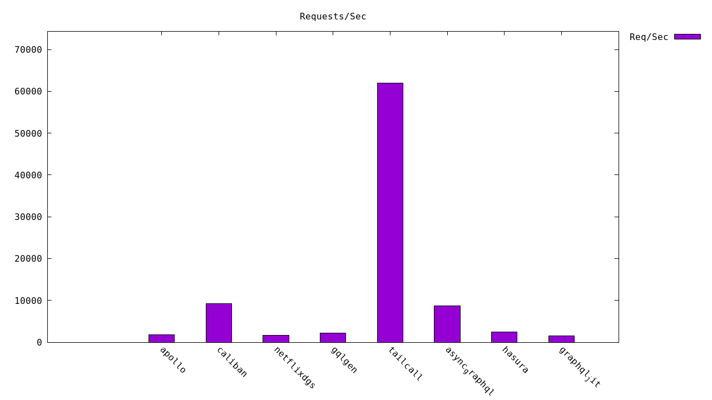
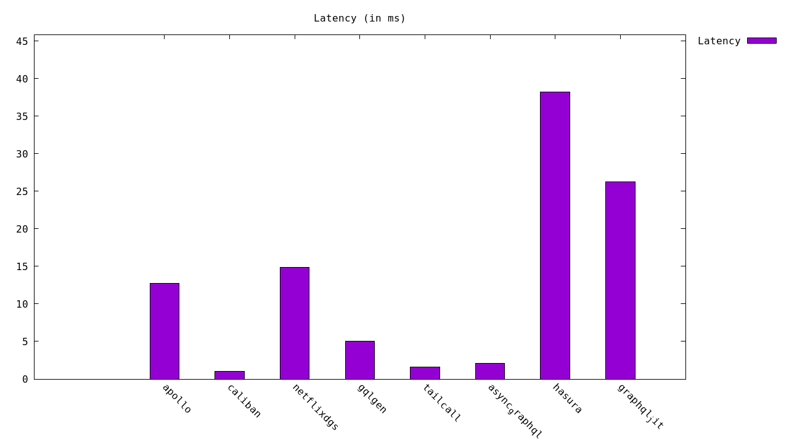

# GraphQL Benchmarks <!-- omit from toc -->

[](https://codespaces.new/tailcallhq/graphql-benchmarks)

Explore and compare the performance of the fastest GraphQL frameworks through our comprehensive benchmarks.

- [Introduction](#introduction)
- [Quick Start](#quick-start)
- [Benchmark Results](#benchmark-results)
  - [Throughput (Higher is better)](#throughput-higher-is-better)
  - [Latency (Lower is better)](#latency-lower-is-better)
- [Architecture](#architecture)
  - [WRK](#wrk)
  - [GraphQL](#graphql)
  - [Nginx](#nginx)
  - [Jsonplaceholder](#jsonplaceholder)
- [GraphQL Schema](#graphql-schema)
- [Contribute](#contribute)

[Tailcall]: https://github.com/tailcallhq/tailcall
[Gqlgen]: https://github.com/99designs/gqlgen
[Apollo GraphQL]: https://github.com/apollographql/apollo-server
[Netflix DGS]: https://github.com/netflix/dgs-framework
[Caliban]: https://github.com/ghostdogpr/caliban
[async-graphql]: https://github.com/async-graphql/async-graphql
[Hasura]: https://github.com/hasura/graphql-engine

## Introduction

This document presents a comparative analysis of several renowned GraphQL frameworks. Dive deep into the performance metrics, and get insights into their throughput and latency.

> **NOTE:** This is a work in progress suite of benchmarks, and we would appreciate help from the community to add more frameworks or tune the existing ones for better performance.

## Quick Start

Get started with the benchmarks:

1. Click on this [link](https://codespaces.new/tailcallhq/graphql-benchmarks) to set up on GitHub Codespaces.
2. Once set up in Codespaces, initiate the benchmark tests:

```bash
./setup.sh
./run_benchmarks.sh
```

## Benchmark Results

<!-- PERFORMANCE_RESULTS_START -->

| Query | Server | Requests/sec | Latency (ms) | Relative |
|-------:|--------:|--------------:|--------------:|---------:|
| 1 | `{ posts { id userId title user { id name email }}}` |
|| [Tailcall] | `29,926.60` | `3.33` | `105.92x` |
|| [async-graphql] | `1,715.08` | `58.21` | `6.07x` |
|| [Hasura] | `1,578.62` | `63.93` | `5.59x` |
|| [Caliban] | `1,537.04` | `65.07` | `5.44x` |
|| [Gqlgen] | `768.93` | `129.06` | `2.72x` |
|| [Netflix DGS] | `358.03` | `210.26` | `1.27x` |
|| [Apollo GraphQL] | `282.55` | `347.81` | `1.00x` |
| 2 | `{ posts { title }}` |
|| [Tailcall] | `62,158.20` | `1.60` | `38.89x` |
|| [Caliban] | `9,116.82` | `11.33` | `5.70x` |
|| [async-graphql] | `8,596.09` | `11.76` | `5.38x` |
|| [Hasura] | `2,486.59` | `40.20` | `1.56x` |
|| [Gqlgen] | `2,176.55` | `47.52` | `1.36x` |
|| [Apollo GraphQL] | `1,723.16` | `57.95` | `1.08x` |
|| [Netflix DGS] | `1,598.26` | `69.40` | `1.00x` |
| 3 | `{ greet }` |
|| [Tailcall] | `64,242.50` | `1.57` | `24.65x` |
|| [async-graphql] | `48,930.60` | `2.05` | `18.78x` |
|| [Gqlgen] | `47,012.10` | `5.12` | `18.04x` |
|| [Caliban] | `44,295.60` | `2.59` | `17.00x` |
|| [Netflix DGS] | `8,184.14` | `15.03` | `3.14x` |
|| [Apollo GraphQL] | `7,965.16` | `12.87` | `3.06x` |
|| [Hasura] | `2,606.15` | `38.40` | `1.00x` |

<!-- PERFORMANCE_RESULTS_END -->


### 1. `{posts {title body user {name}}}`
#### Throughput (Higher is better)


#### Latency (Lower is better)


### 2. `{posts {title body}}`
#### Throughput (Higher is better)



#### Latency (Lower is better)


### 3. `{greet}`
#### Throughput (Higher is better)


#### Latency (Lower is better)



## Architecture


A client (`wrk`) sends requests to a GraphQL server to fetch post titles. The GraphQL server, in turn, retrieves data from an external source, `jsonplaceholder.typicode.com`, routed through the `nginx` reverse proxy.

### WRK

`wrk` serves as our test client, sending GraphQL requests at a high rate.

### GraphQL

Our tested GraphQL server. We evaluated various implementations, ensuring no caching on the GraphQL server side.

### Nginx

A reverse-proxy that caches every response, mitigating rate-limiting and reducing network uncertainties.

### Jsonplaceholder

The primary upstream service forming the base for our GraphQL API. We query its `/posts` API via the GraphQL server.

## GraphQL Schema

Inspect the generated GraphQL schema employed for the benchmarks:

```graphql
schema {
  query: Query
}

type Query {
  posts: [Post]
}

type Post {
  id: Int!
  userId: Int!
  title: String!
  body: String!
  user: User
}

type User {
  id: Int!
  name: String!
  username: String!
  email: String!
  phone: String
  website: String
}
```

## Contribute

Your insights are invaluable! Test these benchmarks, share feedback, or contribute by adding more GraphQL frameworks or refining existing ones. Open an issue or a pull request, and let's build a robust benchmarking resource together!
